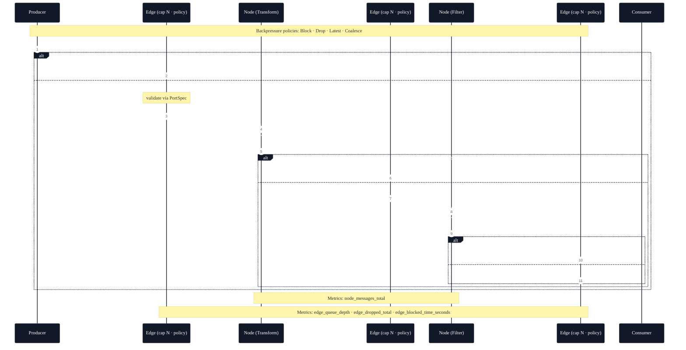
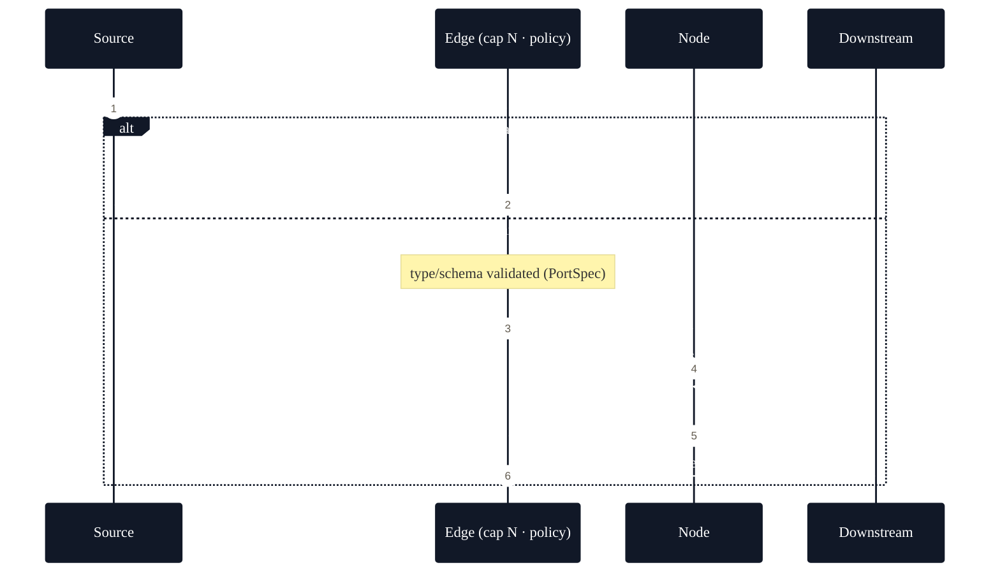
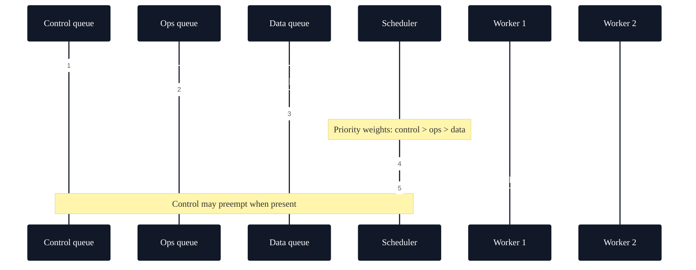

# Architecture

## Summary

This page provides a high-level view of Meridian Runtime's architecture: the core components, how they interact, and the principles that guide the design. It's intended to help you understand the big picture before diving into guides or the API reference.

## Audience

- Engineers evaluating whether Meridian fits their use case
- Contributors who need a mental model of the runtime
- Operators who want to understand runtime behavior and observability surfaces

---

## Design principles

!!! note "Core Philosophy"
    Meridian Runtime prioritizes **predictability** and **observability** over raw performance. Every design decision favors explicit behavior over implicit optimization.

- **Single responsibility**
    - Each component (node, edge, scheduler) has a clear, narrow purpose.
- **Backpressure by default**
    - Bounded queues and explicit overflow policies keep systems stable.
- **Predictable execution**
    - Priority-aware scheduling and controlled concurrency reduce tail risk.
- **First-class observability**
    - Structured logs, metrics, and hooks enable debugging and tuning.
- **Composability**
    - Small nodes compose into subgraphs that compose into applications.
- **Minimal surface**
    - Keep dependencies light and interfaces small; scale complexity with need.

---

## Conceptual overview

At its core, Meridian Runtime executes a directed graph of nodes connected by typed, bounded edges. A scheduler coordinates execution, honoring priorities and backpressure signals. Observability surfaces (logs, metrics, tracing hooks) instrument every stage for visibility.

Key properties:

- Edges are bounded queues; enqueue behavior is governed by policy.
- Nodes implement small, testable units of work.
- The scheduler orchestrates fairness, priority, and throughput.
- Observability is integrated rather than bolted on.

---

## Core components

### Node

!!! info "See Also"
    For detailed Node API, see [API: Node](../reference/api.md#node).

- Definition
    An active unit that consumes messages, performs work, and emits messages.
- Responsibilities

    - Validate and transform inputs
    - Handle errors locally when possible
    - Emit outputs, metrics, and structured logs
- Characteristics

    - Single responsibility, predictable side effects
    - Composable into [subgraphs](#composition-and-subgraphs)
    - May be stateful (with careful lifecycle) or stateless

### Edge

!!! warning "Critical Design Choice"
    All edges are **bounded by default**. Unbounded queues are not supported as they can lead to memory exhaustion and unpredictable behavior.

!!! info "See Also"
    For detailed Edge API, see [API: Edge](../reference/api.md#edge).

- Definition
    A typed, bounded queue connecting two nodes.
- Responsibilities

    - Enforce type/schema for messages
    - Provide flow control via bounds
    - Apply overflow policy on backpressure
- Overflow policies

    - block: backpressure the producer until space is available
    - drop-newest / drop-oldest: shed load explicitly
    - coalesce: merge messages (e.g., keep latest state)
    - timeout: fail fast and surface diagnostics

!!! info "See Also"
    For detailed overflow policy implementation, see [API: Backpressure and overflow](../reference/api.md#backpressure-and-overflow).

### Scheduler

!!! note "Cooperative Scheduling"
    The scheduler uses **cooperative multitasking** rather than preemptive scheduling. Nodes must yield control to allow other work to proceed.

- Definition
    The runtime's orchestrator for executing work while respecting priorities and backpressure.
- Responsibilities

    - Dispatch ready work units
    - Honor priority (e.g., control-plane > data-plane)
    - Manage concurrency and fairness
    - Facilitate graceful shutdown and draining
- Behaviors

    - Priority-aware queues
    - Cooperative backpressure handling
    - Health signals and readiness/liveness reporting

!!! info "See Also"
    For scheduler configuration options, see [API: Scheduler](../reference/api.md#scheduler).

### Observability

!!! info "See Also"
    For detailed observability configuration, see [API: Observability](../reference/api.md#observability).

- Definition
    Integrated logging, metrics, and optional tracing hooks.
- Responsibilities

    - Emit structured logs with correlated context (e.g., trace IDs)
    - Provide metrics (counters, gauges, histograms) for nodes and edges
    - Expose health and performance endpoints
- Examples

    - node.processed.count
    - edge.enqueue.latency
    - scheduler.run.queue_depth
    - runtime.health.status

---

## Message flow

!!! info "See Also"
    For a visual representation, see [Message flow diagram](#message-flow-simplified).

1. Ingress
   Messages enter via sources or upstream nodes. Validation and typing occur at boundaries.

2. Queuing
   Edges buffer messages with explicit capacity. When full, overflow policy applies.

3. Scheduling
   The scheduler selects the next work item considering priority and readiness.

4. Processing
   The node executes work, emitting logs and metrics. Failures are handled locally if possible.

5. Egress
   Outputs are enqueued to downstream edges; observability data is emitted.

6. Backpressure
   If any downstream edge is full, enqueue follows policy, potentially signaling upstream slowdowns.

---

## Lifecycle and operations

- Initialization
    - Construct graph (nodes, edges, subgraphs)
    - Validate topology and types
    - Initialize nodes and scheduler, register observability
- Startup
    - Scheduler begins dispatching
    - Health transitions to "ready" when nodes are initialized and draining is zero
- Steady state
    - Work flows with continuous metrics/logs
    - Backpressure and priorities balance throughput and latency
- Shutdown (graceful)
    - Stop accepting new work
    - Drain in-flight edges
    - Tear down nodes and release resources
- Failure handling
    - Localized retries where idempotent
    - Dead-letter or quarantine for unrecoverable messages
    - Emitted diagnostics for root cause analysis

---

## Priorities and control plane

!!! warning "Priority Preemption"
    Control-plane messages can **preempt** data-plane work to ensure critical operations (like shutdown) are never blocked by application load.

- Priority classes
    - Control: shutdown, kill switch, health probes (highest)
    - Operational: reconfiguration, housekeeping
    - Data: application payloads (default)
- Rationale
    Ensures that critical control actions are not starved under load spikes.
- Implementation notes
    Separate queues or weighted scheduling; preemption only where safe.

!!! info "See Also"
    For priority implementation details, see [API: Message](../reference/api.md#message).

---

## Composition and subgraphs

!!! info "See Also"
    For detailed Subgraph API, see [API: Subgraph](../reference/api.md#subgraph).

- Subgraphs encapsulate a set of nodes/edges with defined ingress/egress.
- Benefits

    - Reusability across applications
    - Local reasoning about performance and failure modes
    - Easier testing and rollout
- Constraints

    - Maintain clear contracts (types, rate expectations)
    - Avoid leaky abstractions with explicit boundaries

---

## Performance model

- Throughput
    - Dominated by per-node processing cost and edge contention
- Latency
    - Includes queuing delay + processing + scheduling overhead
- Capacity planning
    - Key tunables: edge bounds, concurrency, batch sizes, CPU allocation
- Trade-offs
    - Larger queues smooth bursts but increase tail latency
    - Coalescing reduces work at the cost of intermediate states

---

## Reliability and fault tolerance

- Strategies
    - Idempotent processing for safe retries
    - Timeouts and circuit breakers at boundaries
    - Dead-letter queues for pathological inputs
    - Graceful shutdown with draining
- Recovery
    - Restart nodes with preserved state where appropriate
    - Replay from source when supported

---

## Security considerations

- Inputs
    - Validate and sanitize at ingress; enforce types on edges
- Secrets
    - Never log secrets; prefer metadata over payloads in logs
- Isolation
    - Consider process or thread boundaries for untrusted components
- Telemetry
    - Ensure observability endpoints are access-controlled where needed

---

## Extensibility

- Plug points
    - Node interfaces
    - Edge overflow strategies
    - Scheduler policies (priority, fairness, backoff)
    - Observability sinks (metrics/logs exporters)
- Guidelines
    - Keep extensions narrow and composable
    - Preserve backpressure semantics
    - Document performance and compatibility characteristics

---

## Diagrams

### Message flow (simplified)

### Priority-aware dispatch

---

## Related docs

- [About](./about.md) - Documentation structure and navigation
- [Patterns](./patterns.md) - Common architectural patterns and examples
- [Observability](./observability.md) - Logging, metrics, and tracing
- [Glossary](./glossary.md) - Shared vocabulary and terminology
- [API Reference](../reference/api.md) - Complete API documentation
- [Local development](../guides/local-development.md) - Development setup and workflow

!!! tip "Next Steps"
    After reviewing the architecture, explore [Patterns](./patterns.md) for practical implementation guidance or dive into the [API Reference](../reference/api.md) for component documentation.

---

## Appendix: Operational checks

- Health
    - Liveness/readiness endpoints reflect node/scheduler state
- Metrics SLOs
    - Queue depth < bound threshold under nominal load
    - Error rate within acceptable bounds
    - P(95) latency within target
- Draining
    - Shutdown completes within a defined grace period
- Backpressure
    - No unbounded growth; overflow actions visible in metrics/logs 