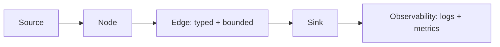

# Guide template

Summary
A short 1–2 sentence overview of what this guide helps you accomplish and who it’s for.

Example:
This guide shows you how to deploy Meridian Runtime to your staging environment using Docker Compose. It’s intended for developers familiar with Docker and basic CLI usage.

Audience
State the expected reader background and prerequisites at a glance.

- Intended for: e.g., backend engineers, SREs, contributors
- Assumes: basic Python, Docker, and Unix shell familiarity

Goals
List the concrete outcomes the reader will achieve.

- Deploy a minimal Meridian graph locally
- Enable structured logs and metrics
- Verify health and graceful shutdown

Non-goals
Clarify what this guide will not cover to prevent scope creep.

- Production hardening
- Cloud-specific IaC (Terraform, CloudFormation)
- Deep dive into the scheduler

Prerequisites
What the reader needs before starting (tools, access, versions).

- Python 3.11+
- uv installed (or pip)
- Docker Desktop (optional for this guide)
- Repo cloned and dependencies installed

Before you begin
Short setup steps to put the reader in a ready state.

1) Clone and install dependencies
```bash
git clone https://github.com/GhostWeaselLabs/meridian-runtime.git
cd meridian-runtime
uv sync
```

2) Run unit tests to ensure the environment is healthy
```bash
uv run pytest -q
```

High-level overview
Provide a brief conceptual framing of what will happen and why. Use a diagram if helpful.



Steps
Numbered, actionable steps with commands and expected output. Each step should be testable and verifiable.

1) Start the example graph
```bash
uv run python -m examples.hello_graph.main
```
Expected output (abridged):
```text
INFO scheduler Started
INFO node.hello Initialized
INFO node.hello Processed 10 messages
```

2) Enable structured logging
Explain where to enable and what to expect. Link to reference if applicable.

3) Expose metrics endpoint
Explain configuration, port, and how to curl it:
```bash
curl -s localhost:8000/metrics | head
```

Validation
How the reader confirms success.

- Logs include node lifecycle events (init, process, shutdown)
- Metrics endpoint returns non-empty payload with counters/gauges
- CTRL+C exits cleanly within N seconds

Troubleshooting
Known failure modes with symptoms and remedies. Link to the broader troubleshooting page for more.

- Port already in use → change METRICS_PORT or stop conflicting service
- Missing dependencies → re-run `uv sync`, verify Python version

Performance and scalability notes
Optional: any guidance on limits, tunables, or costs of this approach.

- Increase queue bounds for bursty inputs
- Prefer backpressure over drop when correctness matters

Security and compliance notes
Optional: mention secrets handling, PII, and logging policies.

- Avoid logging payloads that contain PII; log IDs and metadata only

Cleanup
How to tear down any resources.
```bash
# Stop processes
pkill -f hello_graph.main || true
# Remove local artifacts if any
rm -rf .cache
```

Next steps
Curated links to continue the journey.

- Quickstart: ../getting-started/quickstart.md
- Patterns: ../concepts/patterns.md
- API reference: ../reference/api.md
- Observability: ../concepts/observability.md

Appendix: Template guidance for authors
Keep guides focused on a single task and time-bound (<15 minutes). Split large topics into multiple guides. Prefer copy-pasteable commands and show expected output snippets. Use relative links and keep filenames in lowercase-kebab-case. Headings use sentence case; proper nouns keep their capitalization.

Metadata (optional)
Add a small front matter block when useful for surfaced metadata.

---
owner: docs@your-org
last_updated: YYYY-MM-DD
est_read_time: 10m
status: stable
tags: [guide, getting-started]
---