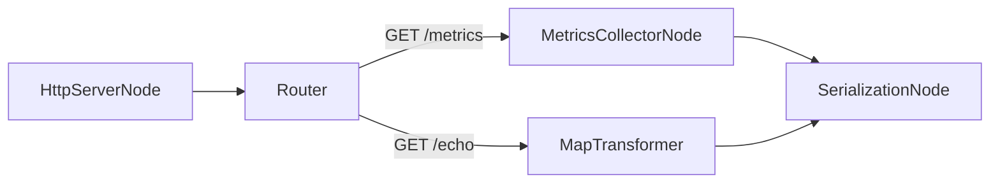

# Simple web server (simulated)

This example shows how to receive HTTP requests and process them via built-in nodes without running a full external server. We use `HttpServerNode`'s `simulate_request()` to focus on flow wiring.

## Topology



## Code

```python
from meridian.core import Scheduler, SchedulerConfig, Subgraph
from meridian.nodes import HttpServerNode, Router, MapTransformer, MetricsCollectorNode, SerializationNode

# Simulated HTTP server node
srv = HttpServerNode("srv")

# Router: route by path
router = Router(
    "router",
    routing_fn=lambda req: "metrics" if req.get("path") == "/metrics" else "echo",
    output_ports=["metrics", "echo"],
)

# Metrics extractor for requests
mc = MetricsCollectorNode(
    "metrics",
    metric_extractors={"requests": lambda req: 1.0},
    aggregation_window_ms=50,
)

# Echo transformer: map request -> minimal response dict
echo = MapTransformer("echo", transform_fn=lambda req: {"path": req.get("path"), "ok": True})

# Serialize any dicts to JSON text
ser = SerializationNode("ser")

g = Subgraph.from_nodes("web", [srv, router, mc, echo, ser])
g.connect(("srv", "output"), ("router", "input"))
g.connect(("router", "metrics"), ("metrics", "input"))
g.connect(("router", "echo"), ("echo", "input"))
g.connect(("metrics", "output"), ("ser", "input"))
g.connect(("echo", "output"), ("ser", "input"))

s = Scheduler(SchedulerConfig(idle_sleep_ms=0, tick_interval_ms=5))
s.register(g)

# Run in background briefly
import threading, time
th = threading.Thread(target=s.run, daemon=True)
th.start()

# Simulate some HTTP requests
for path in ["/", "/echo", "/metrics", "/echo"]:
    srv.simulate_request("GET", path)

# Allow metrics window to flush
time.sleep(0.2)
s.shutdown(); th.join()
```

!!! tip
    Replace `HttpServerNode` with a real adapter to `http.server` or ASGI for production. This keeps the example dependency-free and easy to run.
