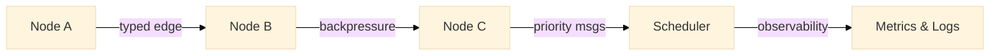

# Meridian Runtime

<div class="mr-hero" style="margin: 1.5rem 0;">
  <div class="mr-hero__content">
    <p style="margin: 0 0 1rem 0; font-size: 1rem; line-height: 1.6; color: var(--mr-text-muted);">Build real-time dataflows from small, single‑responsibility nodes connected by typed, bounded edges — with backpressure, priorities, and first‑class observability.</p>
    <div style="margin-top: 1rem; display: flex; gap: 12px; flex-wrap: wrap;">
      <a class="md-button md-button--primary" href="getting-started/guide.md">Get Started</a>
      <a class="md-button" href="examples/index.md">View Examples</a>
      <a class="md-button" href="https://github.com/GhostWeaselLabs/meridian-runtime" target="_blank">
        <span class="twemoji"><svg xmlns="http://www.w3.org/2000/svg" viewBox="0 0 24 24"><path d="M12 0c-6.626 0-12 5.373-12 12 0 5.302 3.438 9.8 8.207 11.387.599.111.793-.261.793-.577v-2.234c-3.338.726-4.033-1.416-4.033-1.416-.546-1.387-1.333-1.756-1.333-1.756-1.089-.745.083-.729.083-.729 1.205.084 1.839 1.237 1.839 1.237 1.07 1.834 2.807 1.304 3.492.997.107-.775.418-1.305.762-1.604-2.665-.305-5.467-1.334-5.467-5.931 0-1.311.469-2.381 1.236-3.221-.124-.303-.535-1.524.117-3.176 0 0 1.008-.322 3.301 1.23.957-.266 1.983-.399 3.003-.404 1.02.005 2.047.138 3.006.404 2.291-1.552 3.297-1.23 3.297-1.23.653 1.653.242 2.874.118 3.176.77.84 1.235 1.911 1.235 3.221 0 4.609-2.807 5.624-5.479 5.921.43.372.823 1.102.823 2.222v3.293c0 .319.192.694.801.576 4.765-1.589 8.199-6.086 8.199-11.386 0-6.627-5.373-12-12-12z"/></svg></span>
        Source
      </a>
    </div>
  </div>
</div>

## What is Meridian?

**Meridian Runtime** is a minimal, reusable graph runtime for Python that enables you to build real-time, observable dataflows from small, single-responsibility nodes connected by typed, bounded edges.

<div class="grid cards" markdown>

-   :material-graph: **Graph-Based Architecture**

    ---

    Build applications as directed graphs of processing nodes connected by typed edges with built-in flow control.

-   :material-speedometer: **Backpressure & Flow Control**

    ---

    Automatic backpressure with configurable overflow policies ensures your system remains stable under load.

-   :material-eye: **First-Class Observability**

    ---

    Built-in structured logging, metrics, and trace hooks give you complete visibility into your dataflows.

-   :material-cog: **Control Plane Priorities**

    ---

    Priority-based scheduling ensures critical control messages (like kill switches) are processed first.

</div>

## Use Cases

!!! example "Real-world Applications"

    === "Stream Processing"

        Build market data processors, event streams, and real-time analytics with guaranteed backpressure handling.

        ```python
        # Handle high-frequency market data
        market_feed → price_filter → risk_check → trade_signal
        ```

    === "ETL Pipelines"

        Create robust data transformation pipelines with built-in error handling and observability.

        ```python
        # Transform and route data streams
        source → validator → transformer → [sink_a, sink_b]
        ```

    === "Control Systems"

        Implement control planes with priority-based message routing for critical system operations.

        ```python
        # Priority-based control flow
        kill_switch (priority=0) → system_controller
        health_check (priority=1) → system_controller
        ```

## Quick Start

Get up and running in under 2 minutes:

=== "1. Install"

    ```bash
    git clone https://github.com/GhostWeaselLabs/meridian-runtime.git
    cd meridian-runtime
    uv sync  # Creates venv and installs dependencies
    ```

=== "2. Run Demo"

    ```bash
    make demo-sentiment  # Run sentiment analysis pipeline
    # or
    make demo-coalesce   # Run streaming coalesce demo
    ```

=== "3. Explore"

    ```bash
    # Browse examples
    ls examples/
    
    # Start building
    python -m examples.hello_graph.main
    ```

[Get Started :material-arrow-right:](getting-started/guide.md){ .md-button .md-button--primary }
[View Examples :material-code-block-tags:](examples/index.md){ .md-button }

## Core Architecture



<div class="grid cards" markdown>

-   :material-circle-outline: **Nodes**

    ---

    Single-responsibility processing units that consume and emit typed messages.

-   :material-arrow-right: **Edges** 

    ---

    Bounded, typed connections with configurable overflow policies and backpressure.

-   :material-group: **Subgraphs**

    ---

    Composable collections of nodes and edges that can be nested and reused.

-   :material-engine: **Scheduler**

    ---

    Priority-aware runtime that orchestrates message flow and provides observability.

</div>


## Next steps

### Read the guides
- [Quickstart](getting-started/quickstart.md)
- [API reference](reference/api.md)
- [Patterns](concepts/patterns.md)
- [Observability](concepts/observability.md)
- [Troubleshooting](support/troubleshooting.md)

### Contribute and plan
- [Contributing guide](contributing/guide.md)
- [Release process](contributing/RELEASING.md)
- [Roadmap](roadmap/index.md)

***

## Example layout

```text
src/meridian/
  core/           # nodes, edges, subgraphs, scheduler
  observability/  # logs, metrics, tracing hooks
  utils/          # shared utilities
examples/
  hello_graph/          # minimal runnable example
  sentiment/            # control-plane overrides and priorities
  streaming_coalesce/   # coalescing policy under burst pressure
tests/
  unit/           # unit tests
  integration/    # end-to-end graph tests
```

***

## Why Choose Meridian?

!!! tip "Design Philosophy"

    === "Predictable"

        Built-in backpressure and priority scheduling prevent cascading failures.

    === "Observable"

        Structured logging, metrics, and tracing are first-class citizens.

    === "Composable"

        Single-responsibility nodes and typed edges make complex systems simple.

    === "Minimal"

        Lightweight runtime with no heavy dependencies — embed anywhere.

## What's Next?

<div class="grid cards" markdown>

-   :material-rocket-launch: [**Getting Started**](getting-started/guide.md)

    ---

    Set up your environment and build your first dataflow in minutes.

-   :material-code-block-tags: [**Examples**](examples/index.md)

    ---

    Explore real-world demos including sentiment analysis and streaming systems.

-   :material-book-open: [**API Reference**](reference/api.md)

    ---

    Complete documentation of all classes, methods, and configuration options.

-   :material-lightbulb-on: [**Patterns**](concepts/patterns.md)

    ---

    Learn best practices and common architectural patterns.

</div>

---

!!! info "Community & Support"

    **Found an issue?** [Report it on GitHub](https://github.com/GhostWeaselLabs/meridian-runtime/issues)  
    **Want to contribute?** Check our [Contributing Guide](contributing/guide.md)  
    **Need help?** Browse our [Troubleshooting Guide](support/troubleshooting.md)

<div style="text-align: center; margin-top: 2rem; opacity: 0.7;">
<small>Meridian Runtime is developed by <a href="https://github.com/GhostWeaselLabs">GhostWeasel Labs</a> • Available under `BSD-3-Clause` License</small>
</div>